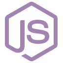

# About Me:

Innovative MERN Stack Developer with a passion for creating engaging user interfaces & experiences. Seeking opportunities to contribute expertise and collaborate with dynamic teams for developing useful and scalable web applications.

## Socials:
[
](https://www.facebook.com/robiuzzaman4)
[ 
](https://twitter.com/robiuzzaman4)

## Tech Stacks:

 
  
  
  
  
  
  
  
  
  
  
  
  
  
  

## Current Stats:

 

  

## Current Streak Stats:

 

  

## Common Languages:

 

  

## Current Overview:

### 🌱 I’m exploring - Modern web thechnologies.
### 👯 I’m looking - To collaborate on a dynamic team.
### 😄 Pronouns - Ruhan.
### ⚡ Fun fact - I love to play Football. 
